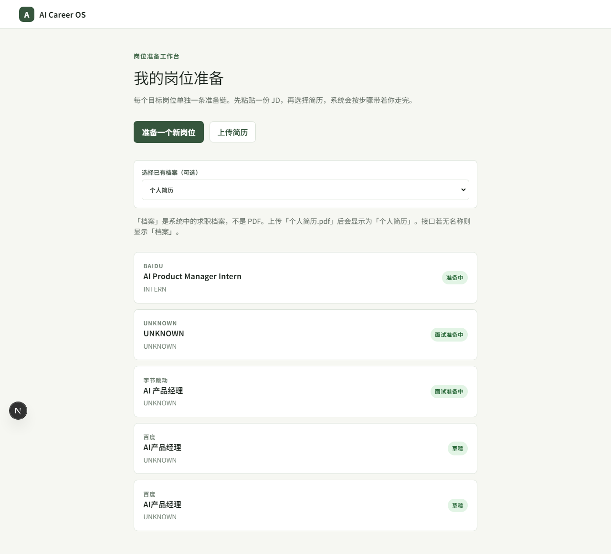
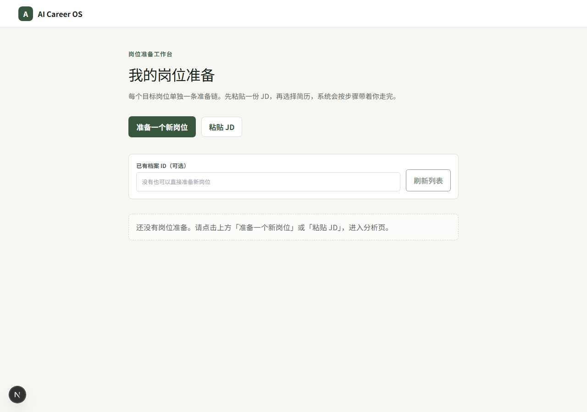
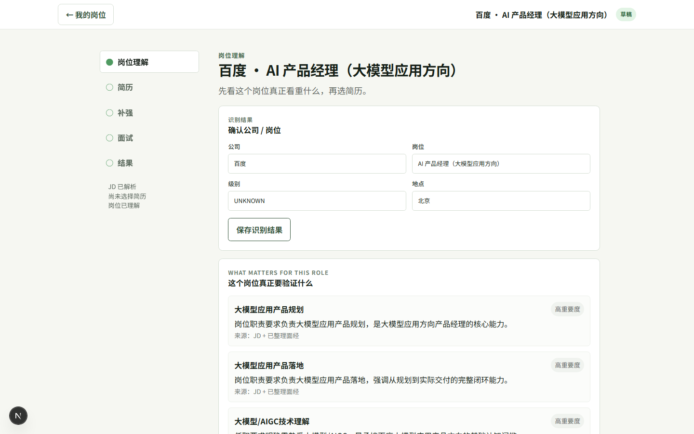
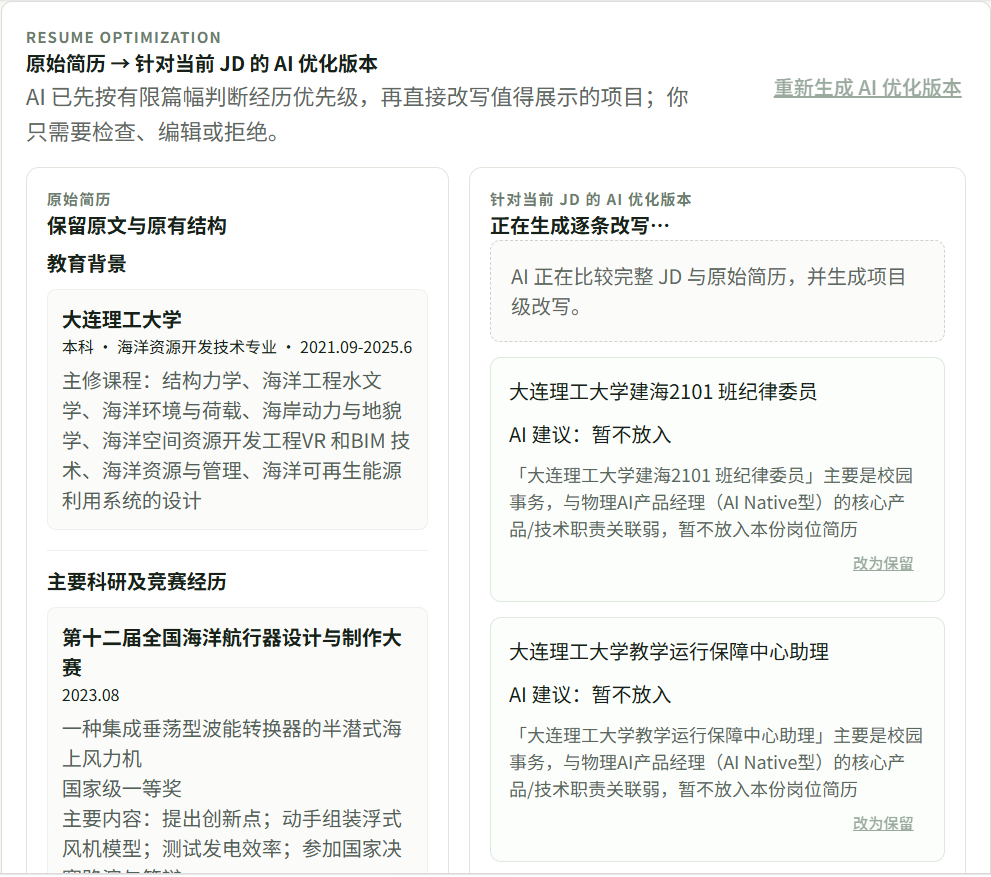
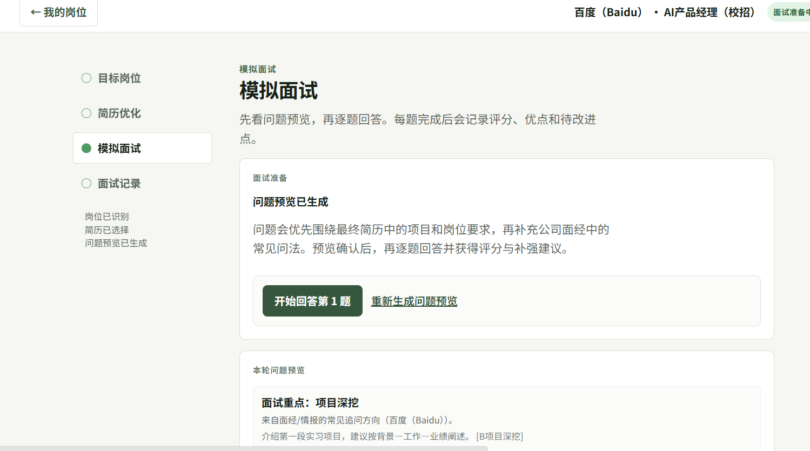
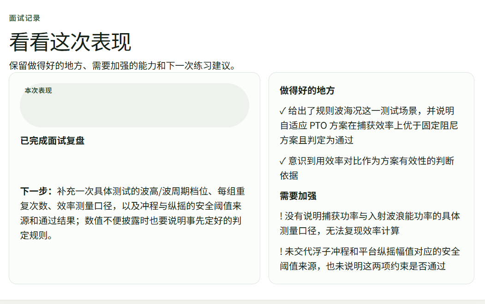
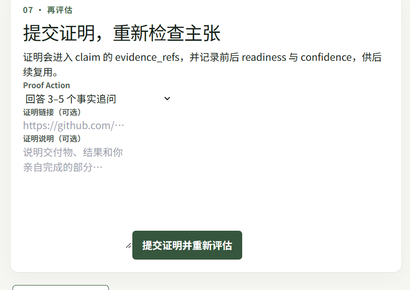

# AI Career OS

AI Career OS turns a job description and a real resume into an evidence-grounded preparation loop:

```text
JD → understand the role → rank resume experiences → rewrite with AI
  → human approval → final resume / PDF → mock interview
  → scoring and coaching → Interview Memory
```

The product is designed for AI product, technical product, and intelligent-hardware roles. It keeps the original resume as the source of truth, separates accepted wording from fact confirmation, and uses curated Nowcoder interview packs as bounded interview context.

## What is included

- AI role understanding and JD-to-experience mapping
- Resume profile confirmation and evidence-grounded rewriting
- Experience ranking: highlight, keep, weaken, or exclude
- Target-resume approval flow and PDF export
- Mock interview with persisted sessions, turns, scoring, and follow-up coaching
- Curated company interview skills in `knowledge/interview_skills/`
- Resume-writing guardrails in `knowledge/resume_skills/`
- Permanent profile deletion with dependent workflow cleanup

## Product tour

The product tour follows one continuous preparation loop. The screenshots below use a Baidu AI product-manager mission to show what the user sees at each decision point.

### 1. Upload a real resume



Start with the candidate's real resume instead of an empty template. The profile picker keeps the uploaded document, parsed profile, and target-role work separate, so a new mission can reuse the same source resume without silently overwriting it. The user can upload a new PDF, select an existing profile, or remove an obsolete profile and its dependent workflow records.

### 2. Paste the job description



Create one job mission per target role by pasting the JD. The mission stores the company, role, location, source JD, resume decisions, interview preparation, and later interview memory in one place. This makes the target role explicit before the AI starts editing the resume.

### 3. Understand what the role actually requires



The role-understanding step turns the JD into a short set of capability signals and priorities. It explains what the hiring team is likely to test, then maps those signals back to the candidate's evidence. This context powers the ranking and rewrite steps; it is not a separate strategy exercise the user has to complete manually.

### 4. Review the AI resume optimization



AI compares the complete JD with the complete source resume and ranks each experience as highlight, keep, weaken, or exclude. For high-value projects it writes actual resume bullets, explains the one-line reason for the edit, and keeps fact confirmation separate from wording approval. The user can accept, edit, or reject each rewrite before generating the final resume and PDF.

The rewrite is grounded in the original evidence. It can structure an existing action such as “测试发电效率” into a clearer testing statement, but it must flag any new number or fact for confirmation instead of inventing it.

### 5. Practice, answer, and turn feedback into next steps



After the final resume is confirmed, the interview flow uses the JD, final resume, curated interview skills, and company interview packs to generate a question preview. The user starts answering only after reviewing the preview, then receives a score and targeted follow-up for the current question.



Every completed round is retained in Interview Memory with the question, answer, strengths, gaps, and next practice focus. The record can be revisited after starting another session, so feedback does not disappear when the next question is generated.



When an answer exposes a weak project detail, the product turns that gap into a concrete coaching suggestion: answer a few factual follow-up questions or improve the project background, personal contribution, and result. The suggestions are instructions for what to do next; they are not silently added to the resume as completed experience.

## Repository layout

```text
apps/web/                       Next.js 15 + TypeScript frontend
apps/api/                       FastAPI + SQLAlchemy backend
knowledge/interview_skills/    curated Nowcoder/company interview packs
knowledge/resume_skills/        evidence-grounded resume writing rules
docs/product/                   product definition and user-flow notes
docs/technical/                 technical specifications
docs/superpowers/               implementation plans, specs, and QA notes
docs/release/                   release manifest and publication assets
tests/                          cross-project checks
```

## Local development

### API

```powershell
cd apps/api
python -m venv .venv
.\\.venv\\Scripts\\Activate.ps1
pip install -r requirements.txt
uvicorn app.main:app --reload --port 8000
```

The API health endpoint is `http://localhost:8000/health`.

### Web

```powershell
cd apps/web
npm install
npm run dev
```

The web app is `http://localhost:3000/missions`.

## Environment

Copy `.env.example` to `.env` for local development. API keys and database URLs belong in the server environment only; never commit `.env` or personal resume data.

The backend uses `DATABASE_URL` for runtime persistence. PostgreSQL is the production target; SQLite fixtures are used for fast unit/API tests. `TEST_DATABASE_URL` must point to a separate PostgreSQL database for the integration gate.

## Curated interview intelligence

Interview packs are Markdown files with source metadata and provenance. The curated packs under `knowledge/interview_skills/curated/` were imported from the companion interview repository and include company-specific questions and focus areas. The backend projects only bounded fields such as skill name, source references, focus, and question patterns into resume, interview, and proof prompts.

To refresh the curated packs from the companion source:

```powershell
cd apps/api
python -m app.interview_skill_importer `
  --source G:\\myself\\aicareeri-interview `
  --dest ..\\..\\knowledge\\interview_skills\\curated
```

## Verification

```powershell
cd apps/web
npm run type-check
npm test

cd ..\\api
python -m pytest -q
python -m compileall -q app
```

The PostgreSQL integration suite is intentionally skipped when no dedicated `TEST_DATABASE_URL` is configured. The release manifest records the exact verification scope for the published snapshot.

## License and data

This repository contains the application source and curated skill material. Do not commit personal resumes, candidate evidence, generated database files, API credentials, or raw audit exports.
